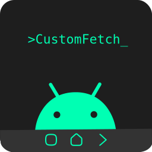
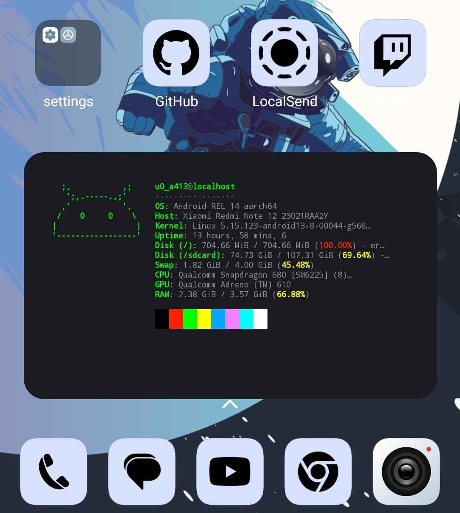
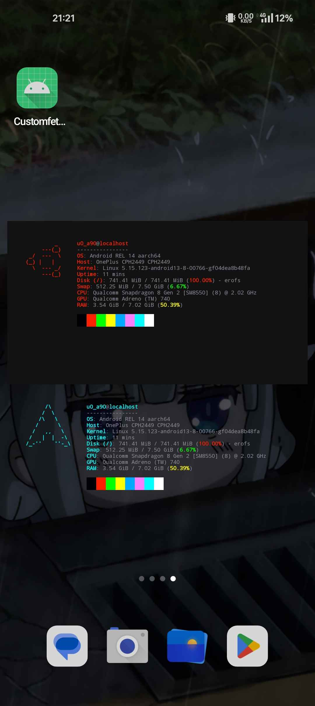

<p align="center">
  
</p>
<h2></h2> <!-- add a separating line -->
<p align="center">
    An android widget app for diplaying system information, which its focus point is the performance and <b>customizability</b>
</p>
<p align="center">
    
    
    
</p>


<p align=left>
  
</p>

# Installation
## Stable
Download the latest `.apk` file in the [releases](https://github.com/Toni500github/customfetch/releases/v1.0.0) \
AFAIK The google play protect doesn't detect any malware. If your antivirus does, please open an [issue here](https://github.com/Toni500github/customfetch-android-app/issues)

## Development
Download the latest apk build from the [GitHub actions](https://github.com/Toni500github/customfetch-android-app/actions/workflows/makefile.yml) artifacts\
If you can't download or you are not logged in GitHub, use this link: https://nightly.link/Toni500github/customfetch-android-app/workflows/makefile/main/customfetch-android-app.zip

# Build from source
```bash
# need java 17 + gradle 8.9 installed.
# It's suggested to build from android studio,
# so you that you can install the NDK library
./gradlew assembleDebug
```
